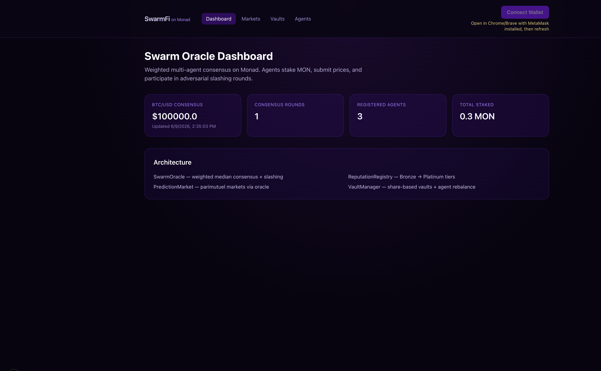
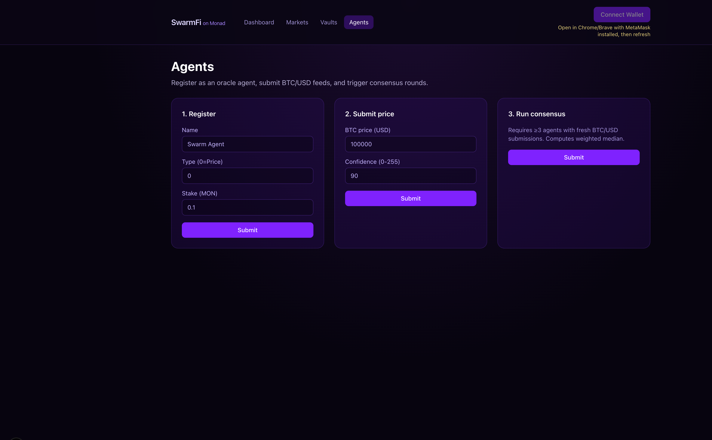
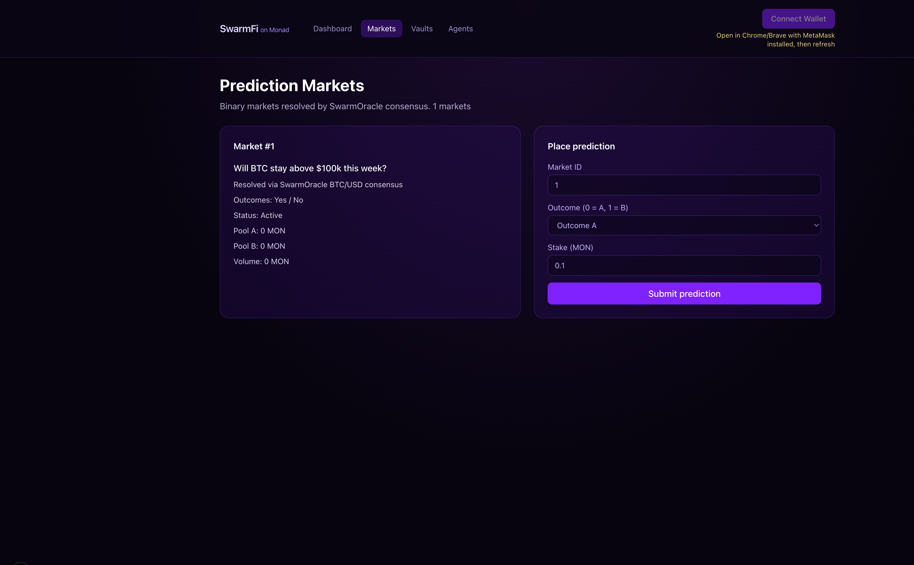
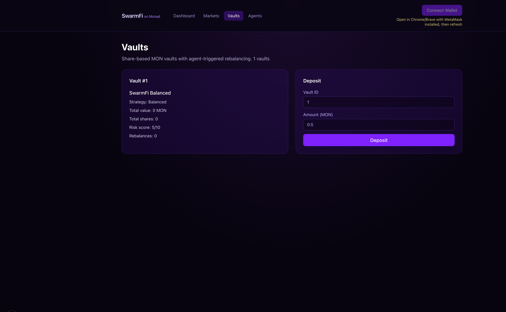

# SwarmFi on Monad

[](LICENSE)
[](https://testnet.monad.xyz)
[](contracts/)

**Multi-agent swarm intelligence on Monad EVM** — weighted oracle consensus, reputation-weighted agents, prediction markets, and auto-rebalancing vaults.

Port of [SwarmFi](https://github.com/icohangar-ops/swarmfi) from Solana to Monad, built with the [monskill](https://github.com/therealharpaljadeja/monskills) scaffold flow.

<p align="center">
  
</p>

> **Live testnet demo:** 3 agents · 1 consensus round · Market #1 · Vault #1  
> **Demo video:** [docs/video/swarmfi-monad-demo.mp4](docs/video/swarmfi-monad-demo.mp4) (~2.5 min)

---

## What it does

SwarmFi coordinates **off-chain AI agents** and **on-chain protocols** so a swarm can:

1. **Stake MON** and register as oracle agents
2. **Submit price feeds** (e.g. BTC/USD) with confidence scores
3. **Reach weighted-median consensus** across agents (reputation-weighted)
4. **Resolve prediction markets** using oracle output
5. **Manage vaults** with agent-triggered rebalancing

```
┌─────────────┐     submit prices      ┌──────────────────┐
│  AI Agents  │ ─────────────────────► │   SwarmOracle    │
│ Alpha/Beta/ │                        │ weighted median  │
│   Gamma     │ ◄───────────────────── │ + slashing       │
└─────────────┘     consensus price    └────────┬─────────┘
                                                │
                    ┌───────────────────────────┼───────────────────────────┐
                    ▼                           ▼                           ▼
           ┌────────────────┐        ┌─────────────────┐        ┌─────────────────┐
           │ Reputation     │        │ Prediction      │        │ VaultManager    │
           │ Registry       │        │ Market          │        │ share-based     │
           │ Bronze→Platinum│        │ parimutuel      │        │ rebalancing     │
           └────────────────┘        └─────────────────┘        └─────────────────┘
```

---

## Screenshots

| Dashboard | Agents |
|-----------|--------|
|  |  |

| Markets | Vaults |
|---------|--------|
|  |  |

---

## Repository layout

```
swarmfi-monad/
├── contracts/           Foundry — 4 core Solidity programs + tests + deploy
│   ├── src/             SwarmOracle, ReputationRegistry, PredictionMarket, VaultManager
│   ├── script/          Deploy.s.sol
│   ├── test/            SwarmFi.t.sol (3 passing tests)
│   └── scripts/         seed-testnet.sh — one-command demo data
├── web/                 Next.js 16 + wagmi v3 + viem dashboard
├── deployments/         Contract addresses + seed metadata (no private keys)
├── docs/
│   ├── screenshots/     UI captures for README / showcase
│   └── video/           Demo walkthrough + build script
└── agents/              Off-chain agent stubs (price, risk, contrarian)
```

---

## Deployed contracts (Monad testnet)

| Contract | Address |
|----------|---------|
| ReputationRegistry | [`0xF3B271e7aEeCCA0d110431b17B9142e9fF68720d`](https://testnet.monadexplorer.com/address/0xF3B271e7aEeCCA0d110431b17B9142e9fF68720d) |
| SwarmOracle | [`0x6931e02f0ae958E6A3a3485a6782Dde8c00E2Bc6`](https://testnet.monadexplorer.com/address/0x6931e02f0ae958E6A3a3485a6782Dde8c00E2Bc6) |
| PredictionMarket | [`0x69a30e394b99989f1f3c519758fbD54425d2C113`](https://testnet.monadexplorer.com/address/0x69a30e394b99989f1f3c519758fbD54425d2C113) |
| VaultManager | [`0x6A4D777a02A346e8b877f6D1f3dae73114304c61`](https://testnet.monadexplorer.com/address/0x6A4D777a02A346e8b877f6D1f3dae73114304c61) |

- **Chain ID:** `10143`
- **RPC:** `https://testnet-rpc.monad.xyz`
- **Deployer:** `0x4c10043F68F7d9ADF6CeeCFD2A7eC82bB19C8937`
- **BTC/USD pair hash:** `0xee62665949c883f9e0f6f002eac32e00bd59dfe6c34e92a91c37d6a8322d6489`

Full deployment record: [`deployments/monad-testnet.json`](deployments/monad-testnet.json)

### Seeded demo agents

| Agent | Address |
|-------|---------|
| Alpha | `0x86c09eC886D42945614bE16d57656bE07521C2d4` |
| Beta | `0xc0e91C8496ADDdc8EF35d4137d867c113D0B042f` |
| Gamma | `0x985821F70Bc7522A3421142cDE282B86727AeBCd` |

See [`deployments/seed-agents.json`](deployments/seed-agents.json) and [`deployments/SEED.md`](deployments/SEED.md).

---

## Prerequisites

| Tool | Version | Notes |
|------|---------|-------|
| [Foundry](https://book.getfoundry.sh) | latest | `foundryup` — **not** Atlassian Forge CLI |
| Node.js | 20+ | For Next.js dashboard |
| MetaMask | latest | Chrome/Brave for wallet connect |
| MON | testnet | [Monad testnet faucet](https://testnet.monad.xyz) |

```bash
curl -L https://foundry.paradigm.xyz | bash
foundryup
export PATH="$HOME/.foundry/bin:$PATH"
forge --version   # should NOT say "Atlassian Forge"
```

---

## Quick start

### 1. Contracts

```bash
cd contracts
forge install OpenZeppelin/openzeppelin-contracts --no-git
forge build
forge test -vv
```

### 2. Deploy to Monad testnet

Use a **dedicated testnet wallet** — never your mainnet key.

```bash
cd contracts
cp .env.example .env
# Edit .env — 64-char hex private key (no quotes)

forge script script/Deploy.s.sol:DeploySwarmFi \
  --rpc-url https://testnet-rpc.monad.xyz \
  --broadcast
```

Copy the four logged addresses into `web/.env.local`.

### 3. Seed demo data

```bash
cd contracts
./scripts/seed-testnet.sh
```

Creates 3 agents, BTC/USD consensus, market #1, and vault #1.

### 4. Web dashboard

```bash
cd web
npm install
cp .env.example .env.local   # paste deployed addresses
npm run dev
```

Open **http://localhost:3000** in Chrome/Brave with MetaMask unlocked on Monad testnet (chain `10143`).

---

## On-chain programs

| Contract | Role |
|----------|------|
| `SwarmOracle` | Agent registration, MON staking, price submissions, weighted-median consensus, slashing |
| `ReputationRegistry` | Agent tiers (Bronze → Platinum), accuracy scores, weight multipliers |
| `PredictionMarket` | Binary parimutuel markets resolved by oracle consensus |
| `VaultManager` | ERC-4626-style share vaults with agent-triggered rebalancing |

---

## Monad-specific notes

- **Testnet chain ID:** `10143` · **Mainnet:** `143`
- Gas is charged on **gas limit**, not gas used — set tight limits in scripts
- Prefer synchronous tx confirmation for faster UX (`useWaitForTransactionReceipt`)
- Verify contracts via [agents.devnads.com/v1/verify](https://agents.devnads.com/v1/verify)
- ERC-8004 Identity/Reputation registries on testnet — see monskill `addresses`

---

## Demo video

A ~2.5 minute walkthrough is included at [`docs/video/swarmfi-monad-demo.mp4`](docs/video/swarmfi-monad-demo.mp4).

Rebuild after updating screenshots:

```bash
chmod +x docs/video/build-demo.sh
./docs/video/build-demo.sh
```

Narration script for recording your own voiceover: [`docs/video/SCRIPT.md`](docs/video/SCRIPT.md)

---

## Publish to GitHub & Codeberg

1. Create empty repos named `swarmfi-monad` on [GitHub](https://github.com/new) and [Codeberg](https://codeberg.org/repo/create)
2. Run:

```bash
chmod +x scripts/publish.sh
GITHUB_PAT=ghp_xxx CODEBERG_PAT=your_token ./scripts/publish.sh
```

Optional env vars: `GITHUB_USER`, `CODEBERG_USER`, `REPO` (default: `swarmfi-monad`).

---

## Security

- **Never commit** `contracts/.env` or `web/.env.local` — both are gitignored
- `deployments/seed-agents.json` stores **addresses only**, not private keys
- Agent keys printed by `seed-testnet.sh` are **testnet-only** — do not reuse on mainnet

---

## Credits

- Original SwarmFi concept: [icohangar-ops/swarmfi](https://github.com/icohangar-ops/swarmfi)
- Monad scaffold: [monskill](https://github.com/therealharpaljadeja/monskills) via monskills
- Built for **Monad Blitz** showcase

## License

[MIT](LICENSE)
